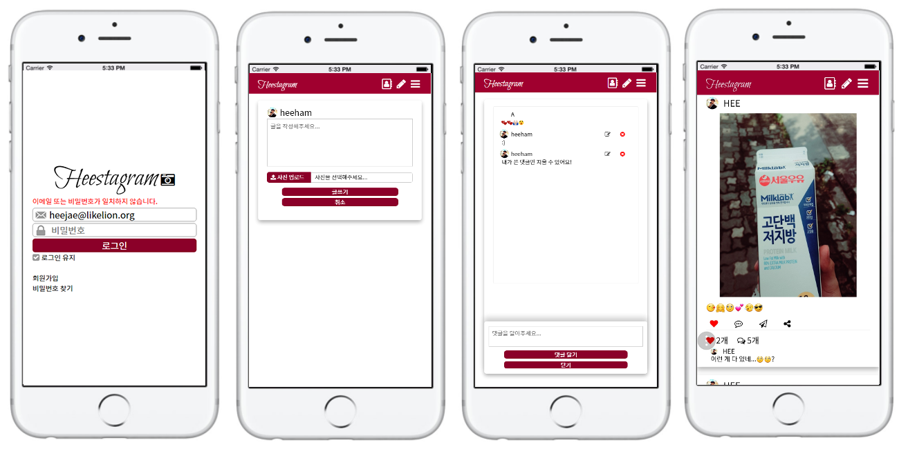

# Heestagram - 고려대 미니 해커톤

Heestagram은 Front-end를 공부하며 CSS3를 적극 활용하여 mobile 환경에서 최대한 native look & feel을 구현하고자 한 프로젝트입니다.

JS는 겸손(Unobstrusive)하게 사용하는 것을 중점으로 뒀습니다.

Backend는 Ruby on Rails 5 를 사용하였고, 이미지는 AWS S3 스토리지에 저장됩니다.

외부 라이브러리를 최대한 사용하지 않고 필요한 기능들을 직접 구현하는 것을 목표로 했으며 AJAX로 SPA(Single-Page Application)를 구현해봤습니다.

주 기능은 다음과 같습니다.

- CSS3 기반의 Tab, Drawer Navigation, Modal View
- 사진을 포함하는 포스팅 기능
- AJAX 기반의 실시간 좋아요 및 댓글 기능
- 무한 스크롤 기능
